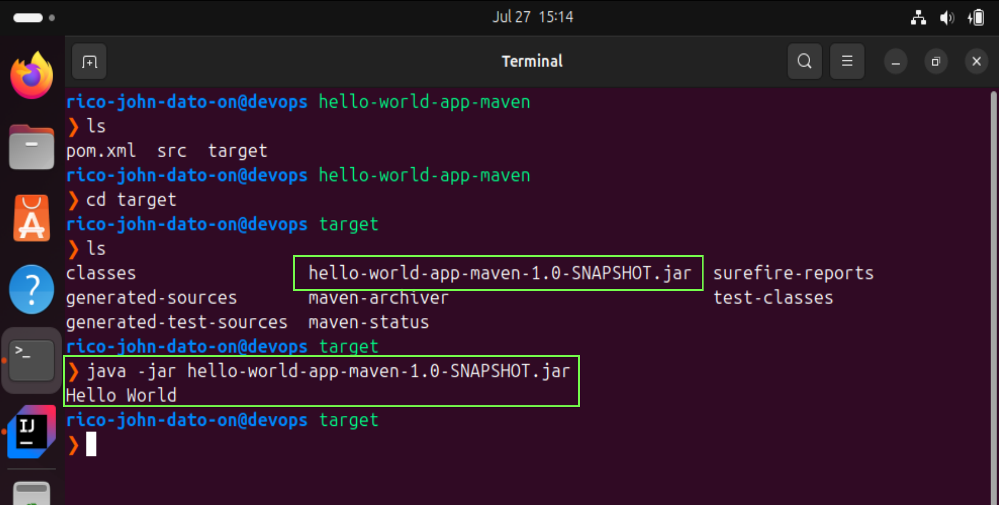
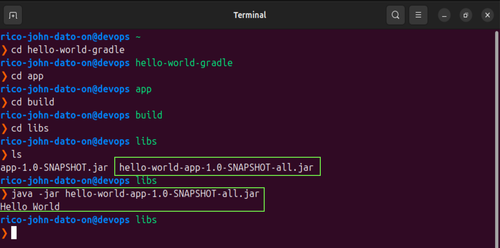

# 🛠️ Build an Artifact - (Maven and Gradle)

After code is written, it must be **packaged** into a single file — an **artifact** — that can be easily deployed to servers for production use. This is done using **build tools**, which vary based on programming language.

---

## 📆 What is an Artifact?

An **artifact** is a packaged version of your application, including:

- Compiled code
- All required dependencies
- Optional configuration files

### ➡️ Why Artifacts Matter:

- Easy to move between environments (dev ➡️test ➡️ prod)
- Stored in **artifact repositories** (e.g., Nexus, JFrog Artifactory)
- Ensures consistent and reliable deployments

---

## 🧰 Build Tools for Java

### 1. **Maven**

**_Sample workflow_**


1. Create Maven App (Terminal)

```bash
mvn archetype:generate \
  -DgroupId=com.example.helloworld \
  -DartifactId=hello-world-app-maven \
  -DarchetypeArtifactId=maven-archetype-quickstart \
  -DinteractiveMode=false
```

2. Open in IntelliJ IDEA

- Open IntelliJ.
- Go to File > Open, and select the hello-world-app-maven folder.
- IntelliJ will import the Maven project automatically.

3. Set Up SDK (JDK) in IntelliJ

- Go to File > Project Structure.
- Under Project SDK, click Add JDK.

- Select this path:

```bash
/home/linuxbrew/.linuxbrew/Cellar/openjdk@17/17.0.16/libexec
```

4. Modify App.java

- Navigate to:

```bash
src/main/java/com/example/helloworld/App.java
```

- Replace content with:

```java
package com.example.helloworld;

public class App {
    public static void main(String[] args) {
        System.out.println("Hello World");
    }
}
```

5. Build Project with Maven

```bash
mvn clean install
```

**_You should see:_** BUILD SUCCESS

6. Run the Artifact created on terminal



```bash
 java -jar target/hello-world-app-maven-1.0-SNAPSHOT.jar
```

**_note:_** If you encounter error in the command, check your "pom.xml" settings

- Expected Output:

```bash
Hello World
```

---

### 2. **Gradle**

**_Sample workflow_**


1. Create Gradle App (Terminal)

```bash
mkdir hello-world-gradle
cd hello-world-gradle
gradle init --type java-application
```

2. Open in IntelliJ IDEA

- Open IntelliJ.
- Go to File > Open, and select the hello-world-app-maven folder.
- IntelliJ will import the Maven project automatically.

3. Set Up SDK (JDK) in IntelliJ

- Go to File > Project Structure.
- Under Project SDK, click Add JDK.

- Select this path:

```bash
/home/linuxbrew/.linuxbrew/Cellar/openjdk@17/17.0.16/libexec
```

4. Modify App.java

- Navigate to:

```bash
src/main/java/App.java
```

- Replace content with:

```java
public class App {
    public static void main(String[] args) {
        System.out.println("Hello World");
    }
}
```

5. Build Project with Gradle

```bash
gradle build
```

6. Run the Artifact created on terminal



```bash
java -jar app/build/libs/app-1.0-SNAPSHOT.jar
```

**_note:_** If you encounter error in the command, check your "app/build.gradle" settings

- Expected Output:

```bash
Hello World
```

---

## 🧪 How It Works – Build Process Summary

1. **Install Dependencies** (libraries your app needs)
2. **Compile Code** (turn source code into executable form)
3. **Package into Artifact** (compressed JAR, WAR, ZIP)
4. **Store in Artifact Repo** (for reuse, testing, deployment)

---

## 🧱 Maven vs Gradle – Key Differences

| Feature       | Maven                  | Gradle                         |
| ------------- | ---------------------- | ------------------------------ |
| Config Syntax | XML (`pom.xml`)        | Groovy/Kotlin (`build.gradle`) |
| Speed         | Slower on large builds | Faster (incremental builds)    |
| Flexibility   | Convention-based       | Highly customizable            |
| Command       | `mvn install`          | `gradle build`                 |

---

## 📌 Final Thoughts

Understanding **build tools** like Maven and Gradle is crucial for DevOps engineers to automate packaging, ensure deployment consistency, and manage dependencies effectively. With the right tools and artifact strategy, you streamline software delivery across any environment.

🧑‍💻 _Created by Rico John Dato-on_
🔗 [LinkedIn](https://www.linkedin.com/in/rico-john-dato-on) • [Portfolio](https://ricodatoon.netlify.app)
